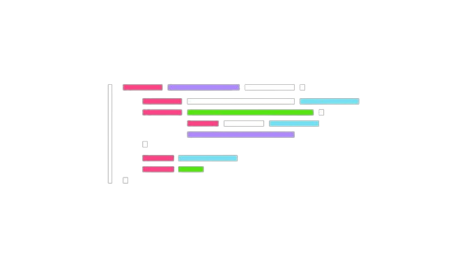

  

  

    <strong style="color:#e6f9f6">🤓 Facts</strong> 
      No mortal programmer has ever mastered more than 20% of C++ and no 2 programmers know the same 20% of C++.
  

<!---->
<!-- <table> -->
<!-- <tr> -->
<!-- <td style="vertical-align:top; padding-right:10px;"> -->
<!--    -->
<!-- </td> -->
<!-- <td style="border-left:4px; border:1px solid #a8e6da; border-radius:6px; padding:10px;"> -->
<!--   <strong style="color:#00bfa6;">🤓 Facts</strong>  -->
<!-- No mortal programmer has ever mastered more than 20% of C++ and no 2 programmers know the same 20% of C++. -->
<!---->
<!-- </td> -->
<!-- </tr> -->
<!-- </table> -->
<!---->

# Welcome! 

This is my corner of the internet, I don't know how you found this place but don't be shy to touch around.
This is where I document my learning, frustrations in my failures and of-course my projects, as unfinished as they are.
